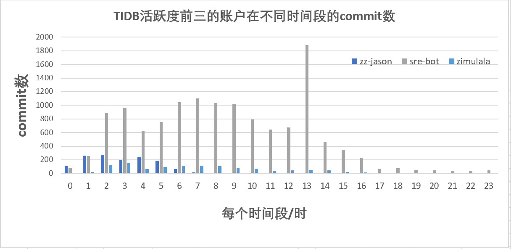
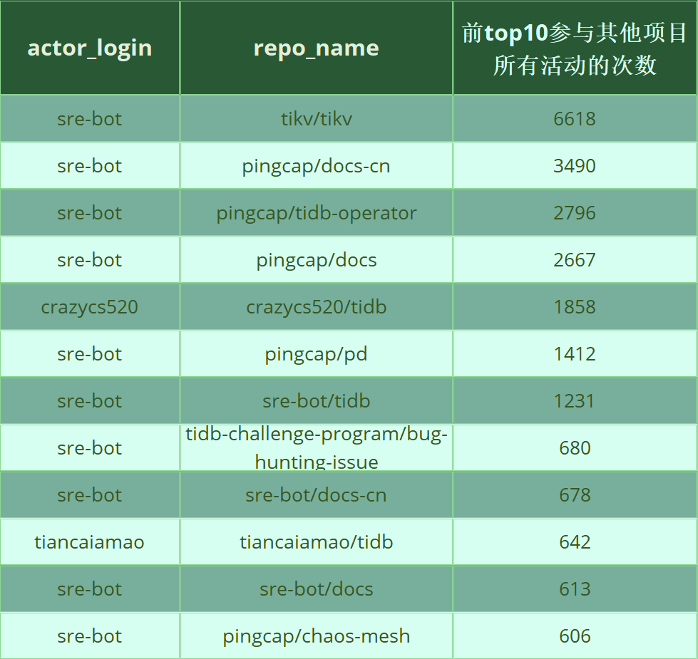
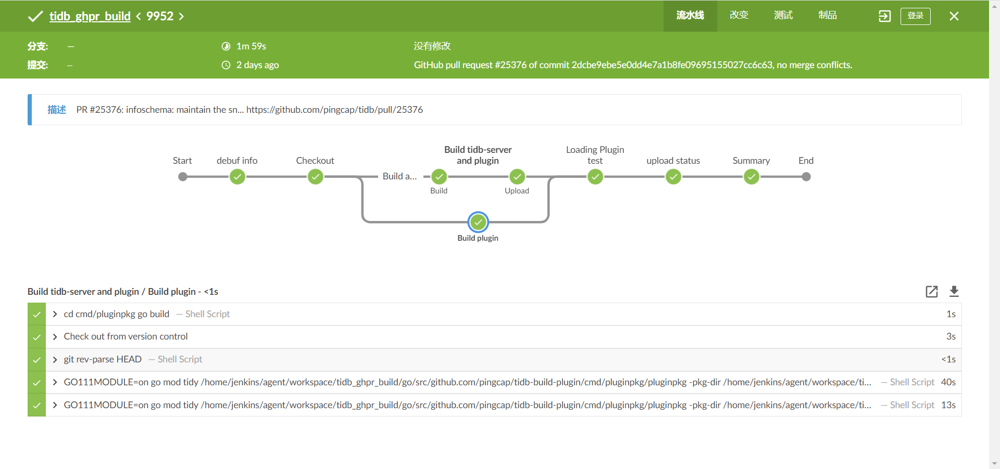

# 数据类
## 1、基础的统计数据分析、可视化
这里使用了year2015-year2021表的数据来进行分析，
每个表包含137列。

数据说明:
- year表归档了github各个事件的产生的日志记录
    - 事件描述参考：https://docs.github.com/cn/developers/webhooks-and-events/events/github-event-types
    - 字段描述参考：https://github.com/X-lab2017/open-digger/blob/master/docs/assets/data_description.csv

### 1.1 Github事件统计

根据2015-2021年的github事件数据，得出下面的每年github事件量图，可以看到，github的事件数量以一个稳定的速度在逐年增加。其中2021年刚过半，因此数据量比较小，但不难看出，今年的github事件数量也是一定能够超越2020年的。

### 1.2 Github使用用户量统计
从github事件统计中，不难看出每年的事件数量是飞速增长的，那么现在来看一下，每年使用github的人是否有明显变化。
从下图中可以看出来，在15年的时候，有大量用户在github上进行包括fork、commit、watch、push等操作，但在16年的时候数据又变少了，之后的每一年也以一个稳定的速度在增长，其中去年更是达到了1454万用户在使用github。

### 1.3 社区受欢迎程度
下面根据2020年全年 GitHub 日志进行统计。
一个社区的活跃度，可以根据该社区的事件数量、参与人数、fork次数、watch次数等进行判断。

因为根据一个项目的事件数进行判断非常不准确，一个机器人项目总共push了5961770次。因此这里用watch事件次数来进行统计。
下图是根据项目的watch事件数量得到的活跃度最高的十五个项目。

|  排名  |  项目   | 数量  |
|  ----  |  ----  | ----  |
| 1 | labuladong/fucking-algorithm |	81980 |
| 2 | jwasham/coding-interview-university | 	63216 | 
| 3 | kamranahmedse/developer-roadmap | 	54291 | 
| 4 | public-apis/public-apis | 	40661 | 
| 5 | donnemartin/system-design-primer	 | 40404 | 
| 6 | EbookFoundation/free-programming-books | 	40061 | 
| 7 | TheAlgorithms/Python	 | 36529 | 
| 8 | danistefanovic/build-your-own-x | 	36519 | 
| 9 | CyC2018/CS-Notes	 | 35388 | 
| 10 | microsoft/PowerToys | 	35338 | 
| 11 | trekhleb/javascript-algorithms | 	35020 | 
| 12 | flutter/flutter | 	33132 | 
| 13 | Snailclimb/JavaGuide	 | 32800 | 
| 14 | denoland/deno | 	32786 |  
| 15 | sindresorhus/awesome	 | 30580 | 

统计得到的结果还是比较让人诧异的，上面几个项目好多都不是大家都知道的有名的开源项目。其中一个原因是，这里统计的是2020年，watch数量增长最快的15个项目。

并且大家更喜欢watch一些教程类型的项目。
- fucking-algorithm：这个项目是《la'buladong的算法小抄》 是讲算法
- jwasham/coding-interview-university： A complete computer science study plan to become a software engineer.
- public-apis/public-apis： 白嫖API
-  microsoft/PowerToys： 微软的项目

### 1.4 开发语言统计

下面对开源项目中使用的语言进行统计。

但在数据中，有54173232个项目的常用语言是空的。
|  排名  |  语言   | 数量  |
|  ----  |  ----  | ----  |
| 1  | JavaScript | 2356153 |
| 2  | HTML | 681045 |
| 3 | Java | 652861 |
| 4 | TypeScript | 618318 |
| 5 | Python | 533666 |
| 6 | Ruby | 415687 |
| 7 | CSS | 313140 |
| 8 | PHP | 294207 |
| 9 | Vue | 246942 |
| 10 | C# | 128885 |

可以看出来github上的项目，主要还是用js和html的比较多，有可能是因为前端代码比较长，且前端项目较多。
后端最受欢迎的语言依然是Java~

## 2、总体宏观统计结果

本次使用2020 年全年 GitHub 日志进行统计，主要对pingcap/tidb这个开源项目进行分析。

### 2.1 TIDB Top 10 开发者账号

我们统计了pingcap/tidb这个项目中活跃度前10的开发者账户，以及他们的活跃度和其他的活动，表格按活跃度降序排序。

从数据统计来看，zz-jason和sre-bot的活跃度远远高于其他的开发者账户。经过后面的分析和调研，sre-bot应该是一个机器人账号，而zz-jason是一个真实存在的开发者。

### 2.2 TIDB开发者每个时间段内的对pingcap/tidb项目的commit数

我们统计了TIDB中所有的开发者在每个时间段内对pingcap/tidb项目的commit数的分布情况。横坐标为时间，对应的是北京东八区的时间；纵坐标为commit的数量。

统计发现在19点到23点之间的commit数很低，我们分析了一下存在这种现象的原因。可能是对于在中国生活的人而言，这段时间大家有自己的生活，需要社交和带娃。此外，我们还发现6点到9点的commit数尤其高，可能是因为存在机器人账号，在这段时间的commit比较频繁。

### 2.3 TIDB活跃度前三的账户在不同时间段的commit数

我们统计了TIDB中活跃度前三的账户在不同时间段对pingcap/tidb项目的commit数的分布情况。横坐标为时间，对应的是北京东八区的时间；纵坐标为commit的数量。

统计分析sre-bot不眠不休地每个时间段都在为pingcap/tidb做贡献，它大概率是个机器人。此外，zz-jason是最活跃的开发者账户，他一般在凌晨0点到6点这段时间commit很频繁。据我们调研，他生活在中国北京，是一个架构工程师，兴趣围绕分布式计算，sql优化和执行，在PingCAP公司的一员。但他为什么一直在这段时间内进行commit，我们不得而知。

### 2.4 与TIDB协作关联度高的前10个项目

我们调研了与TIDB协作关联度高的前10个项目，通过统计了pingcap/tidb这个项目中前top10个活跃者账户参加其他项目所有活动的次数来分析。

我们发现sre-bot是pingCAP公司的机器人，它还负责了公司的其他项目，这些项目都和tidb密切相关，比如tikv是tidb底下的存储引擎，tidb-operator，pd, docs-cn，docs都是和tidb息息相关的。此外，对于开发者账户crazycs520和tiancaiamao都在自己仓库中维护了一份tidb，在他们仓库本地开发tidb。

# 流程类
## 3、项目CI/CD的流程调研
- 开源项目：TiDB
- 项目github地址： https://github.com/pingcap/tidb
### 3.1 分支策略
采用了主干开发，分支发布的策略。master分支上是项目的全量代码，开发人员在特性分支上进行开发，开发完成后将功能合并到master分支中。

TiDB的项目版本发布，大致上是以major + minor进行发布。如2.0、3.0是一个major版本，该版本发布时，创建一个新的分支进行发布。后续如果有新的功能想加到里面，就将特性分支merge进去。minor版本发布的时候，就不切新的分支，而是在该版本进行源码打包。

下图是一个该项目的分支管理策略示意图：

### 3.2 持续集成
开发人员在本地进行开发并且单元测试通过之后，将代码push到远程分支上。以及当开发者，提交pull request时，会触发自动进行测试。
下图是该项目的pull request页面，可以清晰的看到每个pr请求和其测试的状态，测试通过后面会有个小绿勾。

该项目使用了Github + Jenkins来进行持续集成工作。在用户进行push到远程仓库以及提交pr操作时，触发webhook，这个时候jenkins将会根据提交的源码进行环境配置、编译和测试等工作。

这部分的配置不可见。

下面这张图是该项目某一个pr对应的jenkins构建和测试，可以看到它测试失败以后，就不允许进行merge了。

可以查看jenkins pipeline的详细信息,如下图所示：

### 3.3 持续部署
TiDB属于一个产品，不存在典型的线上业务，因此不存在需要对源码进行打包、环境配置、打包镜像、将业务进行上线。这样的典型CD场景。
下面将提供一个类似场景，并且大致说明该项目的部署方式流程。

类似场景

1. 内部集群每天做回归测试，每天12点pull master代码进行测试。
2. 前面提到的开发人员提交之后，会跑测试。

TiDB搭建了一套Github + Jenkins + kubernetes的CICD框架。
提交之后，jenkins会进行镜像打包等操作，然后kubernetes作为一个容器管理调度工具，管理多个容器进行测试的工作，以及测试完成对镜像的销毁和调度新的镜像等工作。

